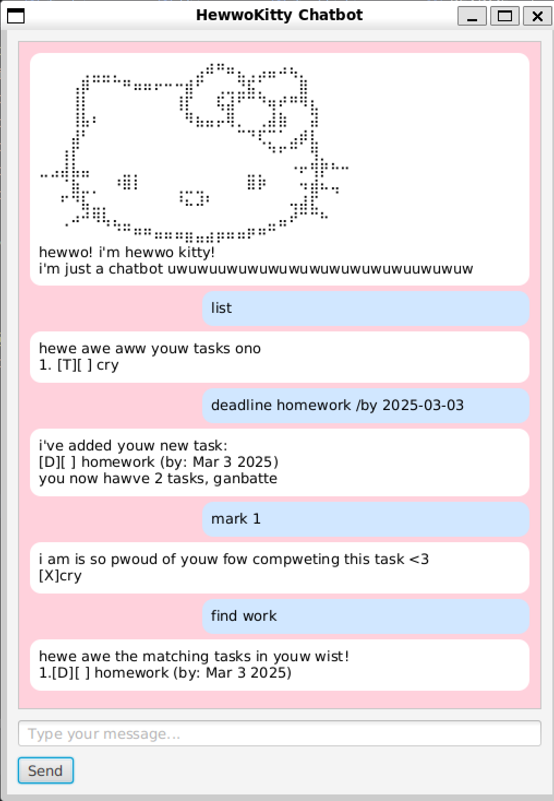

# HewwoKitty Usew Guide UwU

## Managing Tasks

hewwokitty can hewp you keep twack of many twypes of tasks!

**how to use!**
 1. todo [description]
    1. creates a Todo task
2. deadline [description] /by [date in yyyy-MM-dd]
   1. creates a Deadline task
3. event [description] /from [start date] /to [end date]
   1. creates an Event task
4. list
   1. lists all tasks
5. mark [task number] and unmark [task number]
   1. marks a task as complete/incomplete based on the order in the list
6. delete [task number]
   1. removes a task from the list based on the order in the lsit
7. find [keyword]
   1. summarises a list of tasks that contain that keyword
   2. partial searches are possible e.g searching "cry" will also return tasks that are about "crying"

## Some Exceptions
hewwokitty stwuggwes with some exceptions, hewe is what **NOT** to enter
1. do not leave any fields blank
2. dates which are not in yyyy-MM-dd will not be accepted
3. meowmeowmeowmeowmeow (i am a cat)
